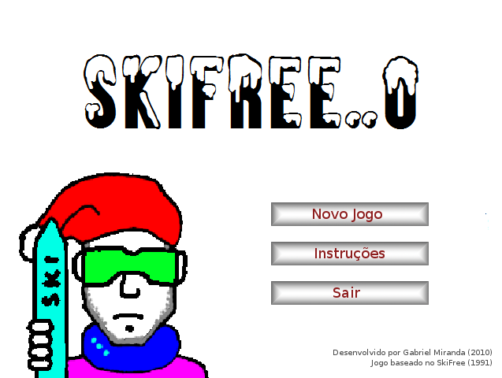
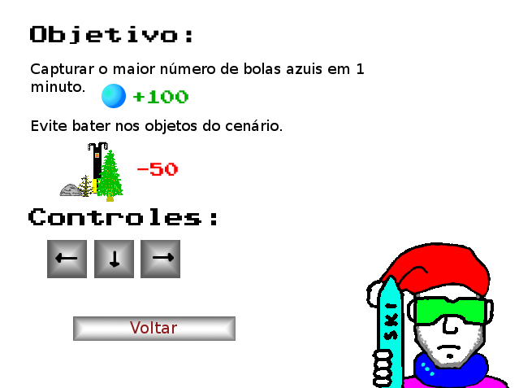
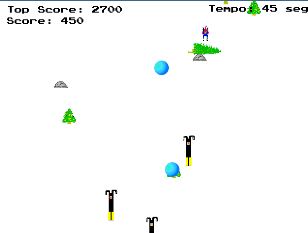

# SkiFree com PyGame

|           |                                                |
|-----------|------------------------------------------------|
| Colégio   | Colégio Técnico da UFMG                        |
| Setor     | Informática                                    |
| Aula      | Disciplina de Algoritmos e Estrutura de dados  |
| Professor | Humberto Honda                                 |
| Aluno     | Gabriel Miranda Pedrosa                        |
| Ano       | 2010                                           |

|  |
|:--:|
| *Tela inicial do jogo* |

|  |
|:--:|
| *Tela de instruções do jogo* |

|  |
|:--:|
| *Gameplay* |

## Introdução

Na procura por uma idéia de um jogo para ser feito no meu trabalho, me lembrei
do SkiFree, um jogo de 1991 para MS-DOS que eu havia jogado na infância. Escolhi
este jogo porque sua idéia é bastante simples, e assim seria a implementação do
jogo em Python.

O jogo é um software livre, tendo, portanto, licença GPL.

## Objetivos

Abranger os conhecimentos sobre a linguagem de programação Python e desenvolver
a lógica de programação de jogos.

## A implementação do jogo

Através de printscreens de uma versão em flash do SkiFree, retirei as imagens do
cenário e do esquiador. Adaptei o código do dodger.py para que o objeto do
cenário fosse escolhido aleatoriamente numa string, que o cenário tivesse
velocidade definida, assim como seu tamanho, e que fossem criados os objetos do
cenário com menos freqüência.

A parte do esquiador foi baseada na idéia de um jogo que vi no pygame.org, em
que as imagens do esquiador ficavam armazenadas numa string e era definida qual
imagem seria usada a partir dos eventos do teclado.

O objetivo seria capturar o maior número de bolas azuis em um minuto. E, cada
vez que o jogador colidisse com objetos do cenário, ele perderia pontos e o
objeto do cenário “quebraria”. A ideia foi sem lógica, mas me ajudou na correção
de erros na contagem da pontuação.

O menu com botões que seriam selecionados pelo mouse e as telas de final do
jogo, onde são exibidas as pontuações finais. O recorde é salvo em um arquivo
para não se perder toda vez que o jogo é fechado.

## Sobre o jogo

Desenvolvido por Gabriel Miranda Pedrosa, em 2010.

## Conclusão

Este trabalho me ajudou a entender mais sobre a linguagem de programação Python,
a lógica do desenvolvimento de jogos e me introduziu a programação orientada a
objeto. Embora meu código não tenha sido desenvolvido em P.O.O., os códigos que
me serviram como base para o estudo no príncipio de meu aprendizado, todos eram
programados orientados a objeto.

## Bibliografia

- http://www.pygame.org/docs/
- http://inventwithpython.com/dodger.py
- Justinian's Rush: http://www.justinsbatchgames.webs.com/downloads.htm

## Questão extra

É possível desenvolver um cenário dinâmico com ambas as versões de pygame. A
ideia é que a medida que o jogo capte os eventos do teclado das setas
direcionais, a tela se mova junto com ele, assim como em jogos de plataforma
como Super Mario, ou Sonic.

Exemplo de código feito por mim mesmo que mexe o mapa de acordo com os
movimentos do teclado:

```python
import pygame, random, sys
from pygame.locals import *

# set up pygame, the window, and the mouse cursor
pygame.init()
mainClock = pygame.time.Clock()
windowSurface = pygame.display.set_mode((640, 480))
pygame.display.set_caption('Dodger')
pygame.mouse.set_visible(False)

mapaImage = pygame.image.load('mapa.png')
mapaRect = mapaImage.get_rect()

moveLeft = moveRight = moveUp = moveDown = False
FPS = 40

def terminate():
    pygame.quit()
    sys.exit()

while True:
	for event in pygame.event.get():
		if event.type == QUIT:
			terminate()

		if event.type == KEYDOWN:
			if event.key == K_LEFT or event.key == ord('a'):
				moveLeft = True
				moveRight = False
			if event.key == K_RIGHT or event.key == ord('d'):
				moveRight = True
				moveLeft = False

		if event.type == KEYUP:
			if event.key == K_ESCAPE:
				terminate()
			if event.key == K_LEFT:
				moveLeft = False
			if event.key == K_RIGHT:
				moveRight = False
	if moveLeft:
		mapaRect.move_ip(10,0)
	if moveRight:
		mapaRect.move_ip(-10,0)

	windowSurface.blit(mapaImage,mapaRect)
	pygame.display.update()
	mainClock.tick(FPS)
```
